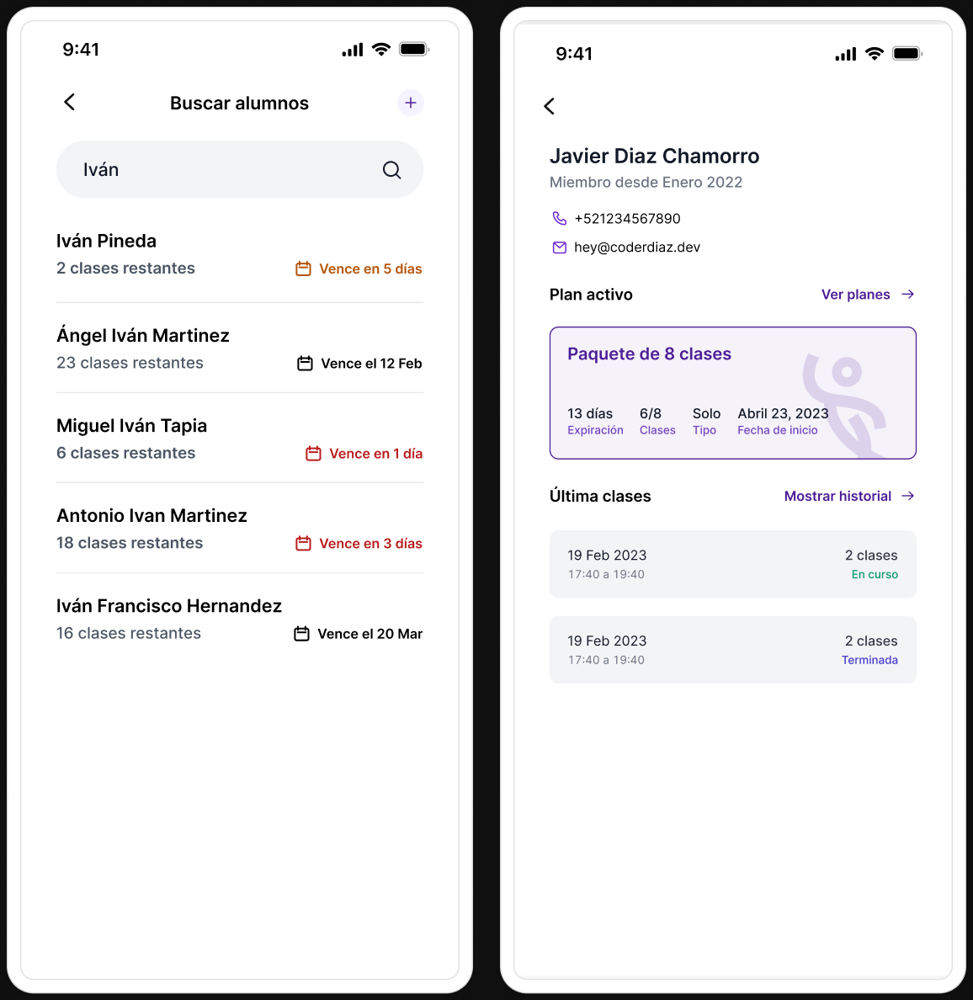
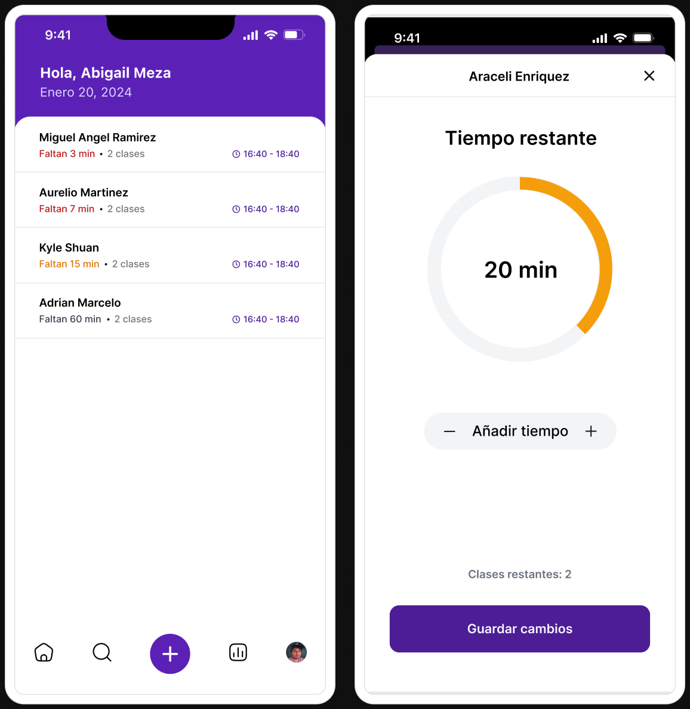
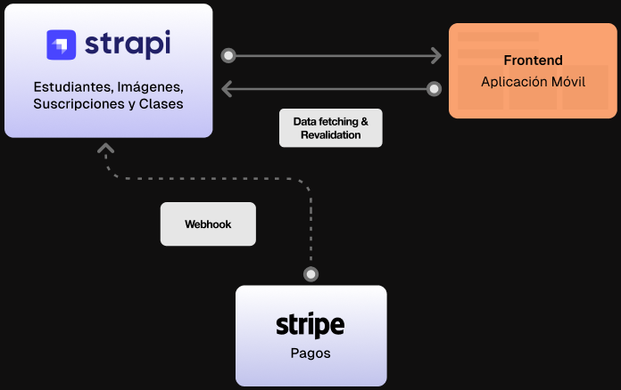

La academia de baile fue fundada a finales de 2022 y el crecimiento de la misma fue incrementando de manera sustancial. Conforme la academia empezó a crecer se empezaron a presentar problemas e inconsistencias en la gestión de los alumnos y sus clases de baile.

Es por ello que surge la necesidad de desarrollar un software que les permitiera llevar un control. En ese momento, todo el control se llevaba acabo utilizando un cuaderno en donde se iban haciendo anotaciones de los paquetes que fueron adquiridos, así como la información de los alumnos y el seguimiento de sus clases.

## Mejorando la experiencia 

Para poder brindar la mejor experiencia a la academia, se realizó un proceso de investigación sobre herramientas existentes con base en las necesidades de la academia. Después de analizar y utilizar algunas opciones con la finalidad de valorar su uso, se decidio por desarrollar una aplicación móvil. Apesar de que algunas de las aplicaciones contaban con ciertos aspectos que eran de utilidad, no se adaptaban al modelo de trabajo de la academia y complejizaban el proceso.

Estás son algunas de las caracteristicas principales que se tomaron en cuenta para el desarrollo:

- Facilidad de uso.
- Seguimiento de clases.
- Control de alumnos y paquetes.

### Control de alumnos y paquetes
Desde esta sección, se puede buscar y dar de alta nuevos alumnos, donde podrás ver de forma rápida la vigencia e información de su paquete activo. También, podrás acceder al detalle del alumno para ver su historial de clases y paquetes adquiridos.

### Gestión de clases
Aquí lo primordial, es la rápidez para registrar a un alumno cuando llega a la academia para tomar su clase. También, se puede ver de forma inmediata el tiempo restante de su clase y el horario en que inicio.

## Tecnologías utilizadas

Después de un periodo corto de evaluación optamos por un stack bastante sencillo pero sofisticado para asegurar la posibilidad de incorporar nuevas funcionalidades en el futuro. Para la aplicación optamos por utilizar React Native, el cuál nos permitio desarrollar una aplicación móvil para iOS y Android. Para el backend se utilizo Strapi, el cuál nos permitio generar nuestra API de manera rápida y sencilla utilizando GraphQL.

A su vez, al utilizar Strapi, se logro que la academia pudiera tener un panel de administración para poder dar de alta registros de alumnos, paquetes y clases de manera sencilla. Esto gracias a que Strapi posee una interfaz fácil de entender y que puede llegar a utilizar cualquier persona sin conocimientos técnicos.

> ¿Te interesa esta aplicación? Estamos seguros que podemos ayudarte a mejorar la gestión de tu academia de baile. Escríbeme a [hola@coderdiaz.com](mailto:hola@coderdiaz.com) y con gusto te haré una demostración.