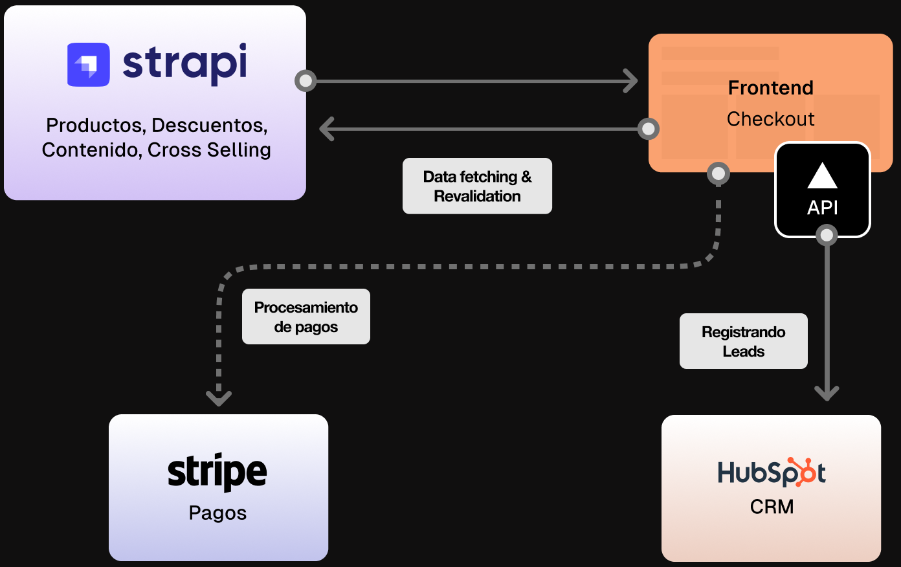
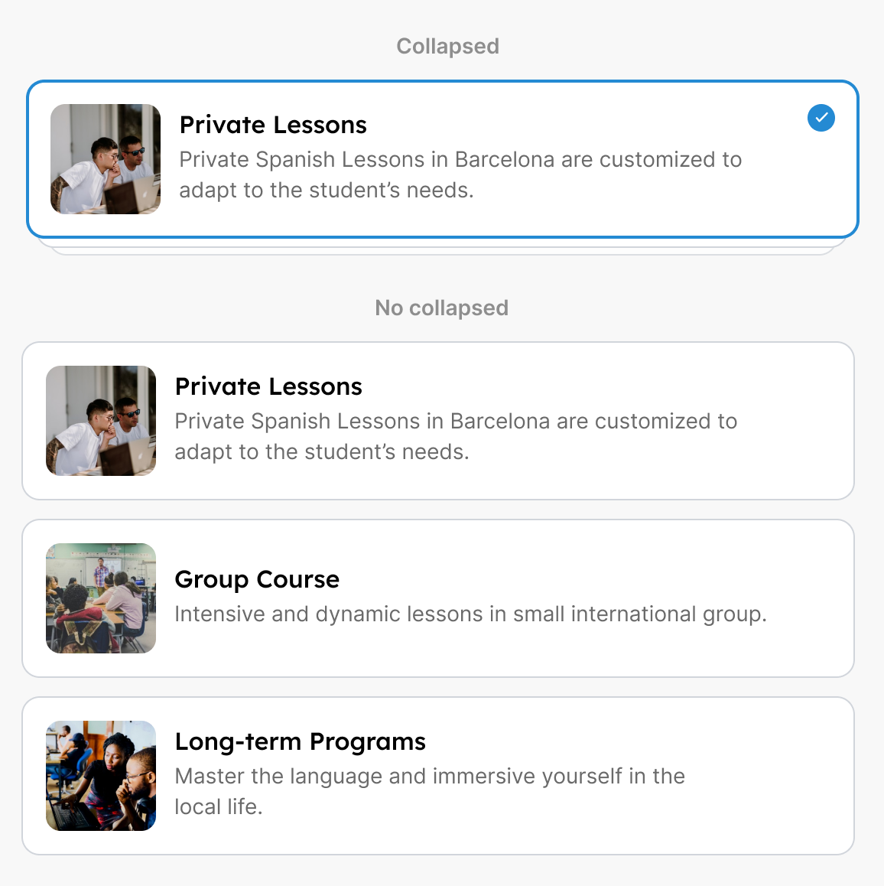
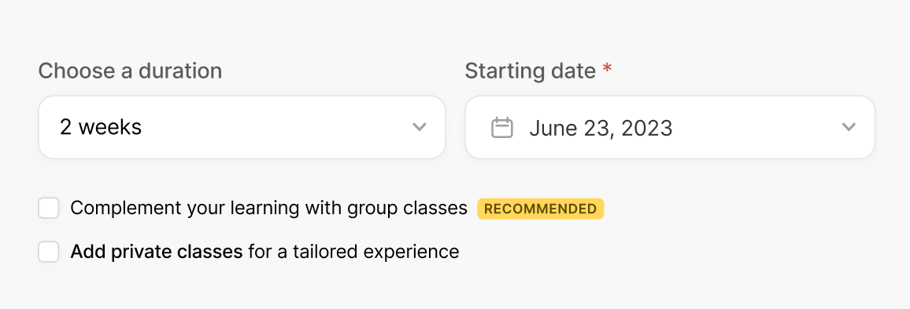
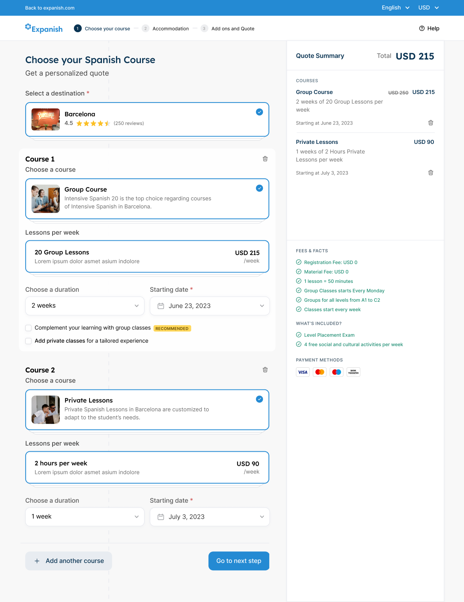
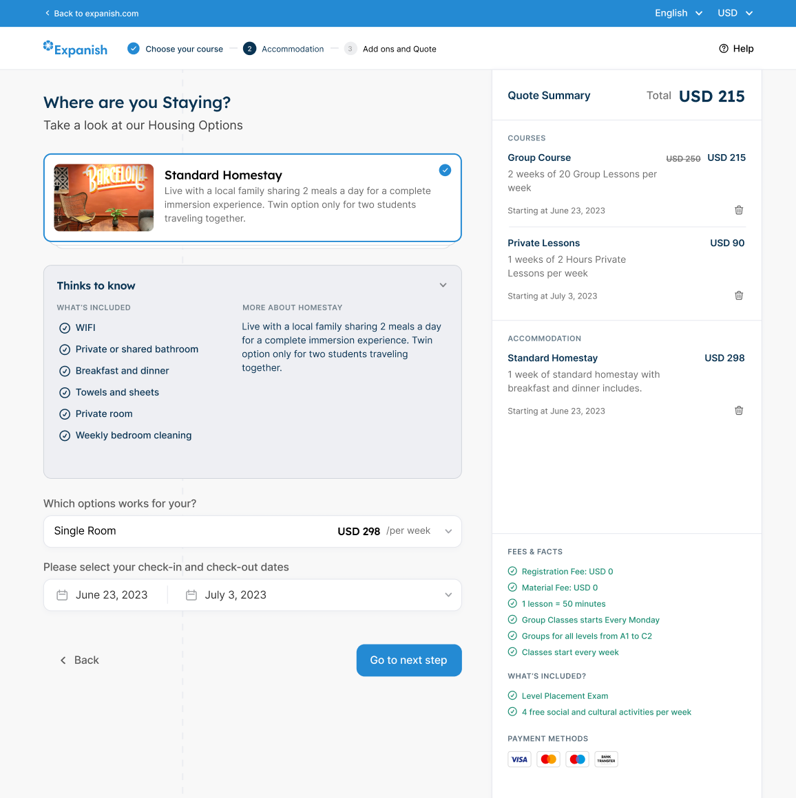

Expanish es una escuela de español con sede en Argentina y España, y se especializa en la enseñanza del idioma español a estudiantes internacionales. La escuela ofrece diferentes tipos de programas, tales como, cursos grupales, clases privadas, cursos de largo plazo, entre otros.

## Retos a resolver
Mejorar la experiencia de compra en el sitio web, para que los usuarios que buscan adquirir un curso, tenga una experiencia rápida y simple. Uno de los principales retos fue mejorar la forma en que actualmente se dan de alta los cursos y sus variaciones de acuerdo a las temporadas y al módelo de negocio. Por lo que se tuvo que trabajar en conjunto con el equipo de operaciones para entender el proceso actual y proponer una solución que sea escalable y fácil de mantener.

## Tecnologías utilizadas
Para mejorar y gestionar la forma en que el equipo de operaciones encargados registrar cada uno de los cursos y promociones, optamos por utilizar un servicio enfocado a la gestión del contenido que se iba a mostrar. Para esto, utilizamos Strapi, un CMS open-source que permite crear diferentes tipos de modelo de contenido y gestionarlos de manera fácil y rápida.

Para el desarrollo web, optamos por utilizar Next.js 14, el cuál nos brinda todas las herramientas necesarias para crear una experiencia de usuario rápida y eficiente. Para el front-end, utilizamos React y TailwindCSS, lo que nos permitió crear una interfaz de usuario moderna y atractiva.

## Propuesta de diseño
Para realizar la propuesta de diseño, se tuvo primero que analizar el comportamiento de uso de acuerdo a los datos que nos proporciono el cliente sobre el uso del sistema que tenían anteriormente. Con esto, se propuso una solución que permitiera a los usuarios adquirir un curso de manera rápida y sencilla, sin tener que pasar por muchos pasos.

Tomando esto en consideración, lo siguiente fue realizar un diseño que fuera funcional pero a su vez atractivo para los usuarios. Por lo que trabajamos en un componente que permitierá poder seleccionar un elemento en concreto pero enriquecido con información que permitiera al usuario tomar una decisión.

Este componente, ayudó mucho a que los usuarios pudieran interactuar de forma simple con las opciones que se les presentaba, y a su vez, les permitia tomar una desición de manera rápida. También, impulsaba a que el usuario sintiera la sensación de haber seleccionado una opción sin complicaciones y en caso de querer cambiar, podía hacerlo de forma simple gracias a la interacción que proporciona este componente.

### Cross selling
Otro de los requerimientos que necesitaba el cliente, era poder mostrar de acuerdo a lo que el usuario selecciona las propuestas de otro tipo de cursos, así como también, promociones que se encontraban disponibles. Por lo que se propuso un diseño que permitiera mostrar de manera clara y concisa las propuestas que se tenían disponibles para así impulsar la conversión.

## Resultados

## Conclusión
El diseño y el desarrollo del nuevo proceso de checkout, permitió a Expanish mejorar la experiencia de compra para sus usuarios, lo que se vio reflejado en un aumento de las conversiones y una disminución en el abandono del carrito. Además, el equipo de operaciones, se vio beneficiado al tener un proceso más eficiente y escalable para la gestión de los cursos y promociones que se ofrecen en la escuela.

Constantemente, seguimos estamos haciendo iteraciones para seguir mejorando la experiencia de acuerdo a los datos que nos proporcionan nuestras herramientas de analítica y de usabilidad.