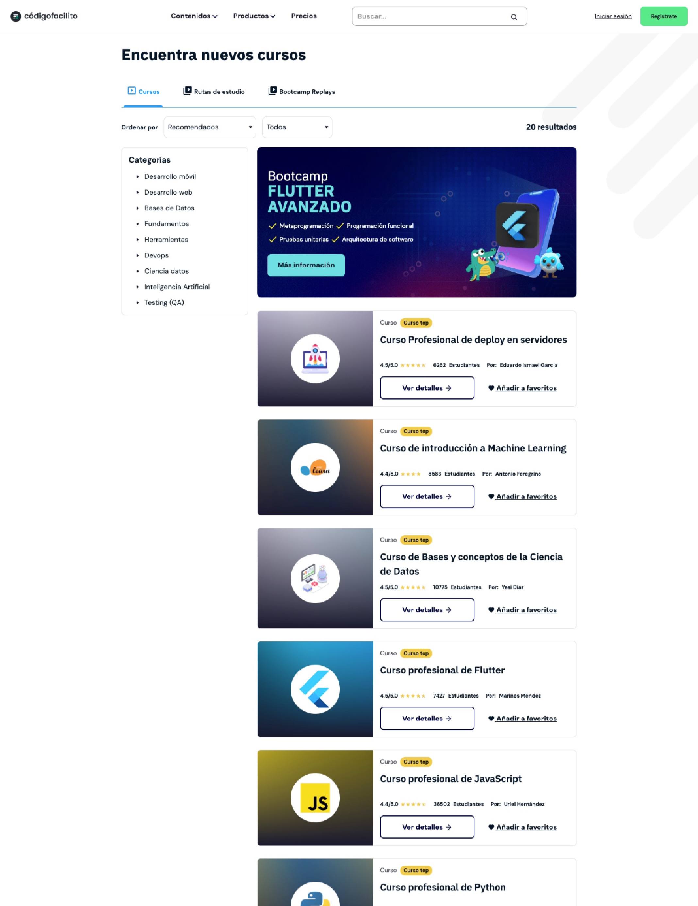
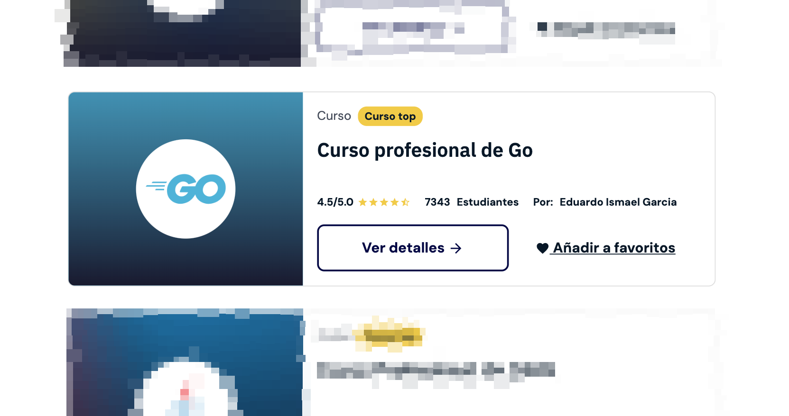
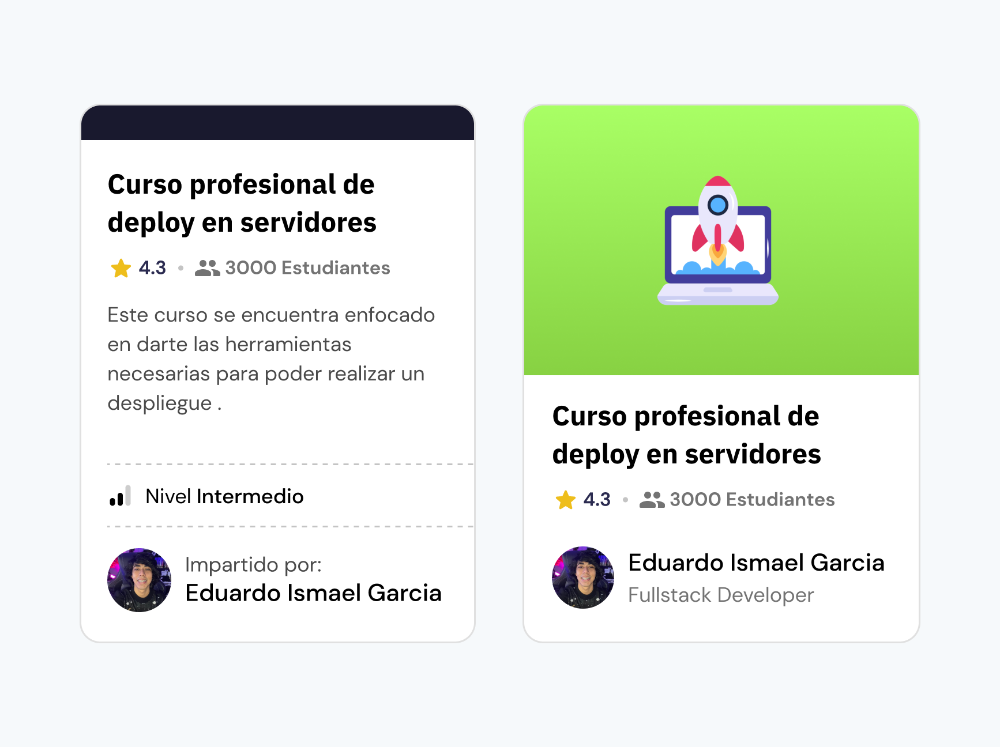
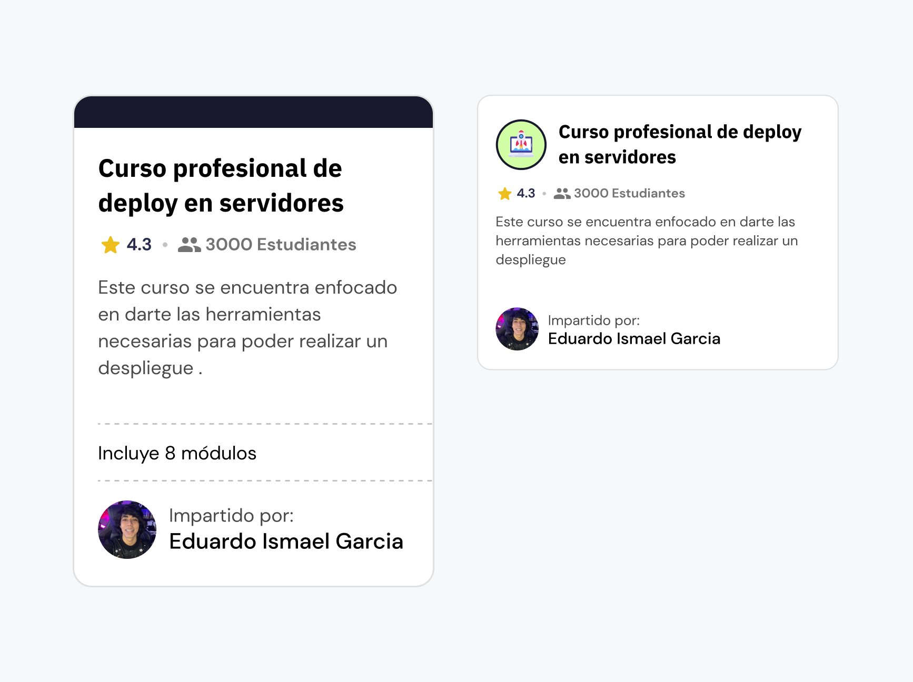
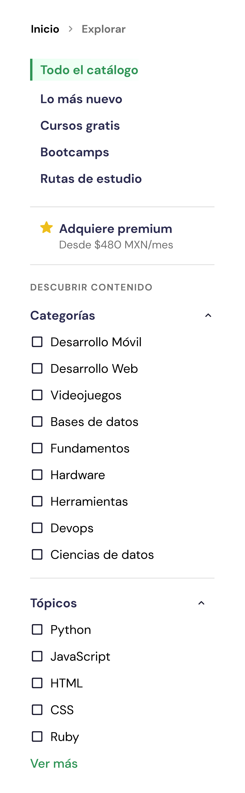

Códigofacilito es una plataforma de educación en línea que ofrece cursos, bootcamps y rutas de estudio para que puedas aprender a programar y mejorar tus habilidades técnicas en el desarrollo de software.

## Retos a resolver
Parte fundamental de este rediseño es buscar una mejor experiencia de búsquedas y navegación del contenido existente en la plataforma desde cursos y bootcamps. Por lo que nos dimos a la tarea de investigar con algunos de sus usuarios necesidades concretas y problemas con los que se han enfrentado al buscar contenido en el sitio web.

### Investigación y descubrimientos
Durante el proceso de investigación, descubrí que en su mayoría los usuarios buscan contenidos muy específicos y que la manera en la que se presenta no es la más adecuada para ellos. Por otra parte, la navegación entre todo el contenido tiende a ser confusa y difícil de seguir, por lo que mantenerse buscando contenido se vuelve una tarea tediosa.

Generalmente, los usuarios tienden a guardar las urls de lo que van consultado para no perder el hilo de lo que buscaron anteriormente y poder retomar su búsqueda en otro momento.

## Situación actual
La plataforma cuenta con un sin fin de contenido de calidad que encontrar dicho contenido no es tarea fácil. Por eso, buscaremos mejorar la experiencia actual con algo que se adapte mejor a las necesidades de sus usuarios.

Aunque la página actual posee diferentes tipos de categorización y filtros que se pueden aplicar, los usuarios no encuentran lo que buscan y se apoyan en este caso con el buscador de la página haciendo que la página sea poco útil.

### Tarjetas actuales
Aquí podemos ver una de las tarjetas de un curso y su anatomia. En ella podremos encontrar información como lo es el tipo, su popularidad, el nombre del curso, su clasificación, instructor y estudiantes inscritos.

Algo que obtuvimos por parte de los usuarios al entrevistarlos, es que aunque llevan tiempo en la plataforma, el instructor es clave para tomar una decisión para tomar el curso. Por lo que se busca que la información del instructor sea más visible.

## Propuesta de diseño
Después de varias entrevistas a estudiantes activos y usuarios de la plataforma se propuso un rediseño de la página de cursos para mejorar la forma en que los usuarios encuentran el contenido que existe en Códigofacilito.

### Visualización de tipos de contenido
Dentro de las investigaciones realizadas, hicimos varias iteraciones para encontrar la forma de presentar los cursos y tipos de contenido, basandonos en diferentes perspectivas que los usuarios comentaron, algunos preferian tener una imagen alusiva al curso y otros preferian tener una descripción más detallada.

Después de varias evaluaciones la tarjeta con la imagen en grande fue la más aceptada por los usuarios.

### Filtros y categorías
Otro de los puntos que los usuarios mencionaron fue la dificultad para encontrar el contenido, así que lo que hicimos fue mejorar la manera en la que los usuarios pueden ir aplicando diferentes tipos de filtros para encontrar el contenido que buscan.

En este caso, se propuso una barra de filtros que se mantendrá fija a un costado de la pantalla para que los usuarios puedan ir aplicando diferentes filtros sin perder de vista el contenido que están viendo. De esta manera, se podrá segmentar el contenido por categorías, temas, entre otros.

También incluimos una sección con la que buscamos convertir a usuarios interesados en el contenido para que adquieran una suscripción a la plataforma y así puedan acceder a todo el catálogo.

## Conclusiones
Con este rediseño se espera que cientos de usuarios disfruten de una mejor experiencia al buscar contenido en la plataforma y que además, puedan seguir impulsando su crecimiento en sus habilidades de acuerdo a lo que necesitan. Además, se espera que la plataforma pueda seguir creciendo y que más usuarios se unan a la comunidad de Códigofacilito.