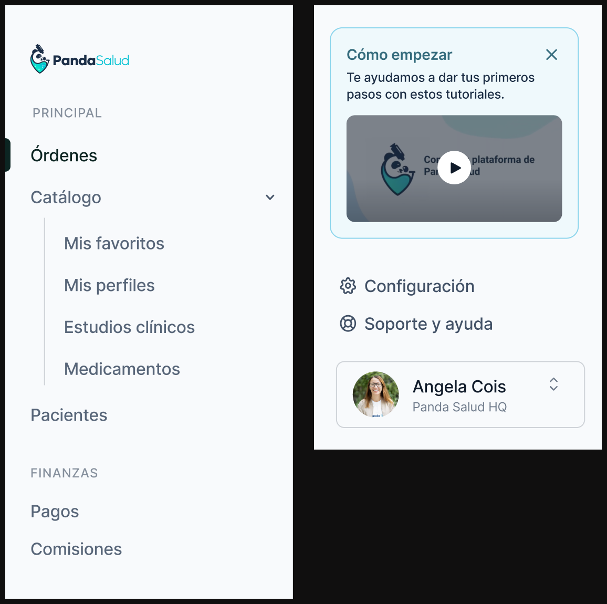
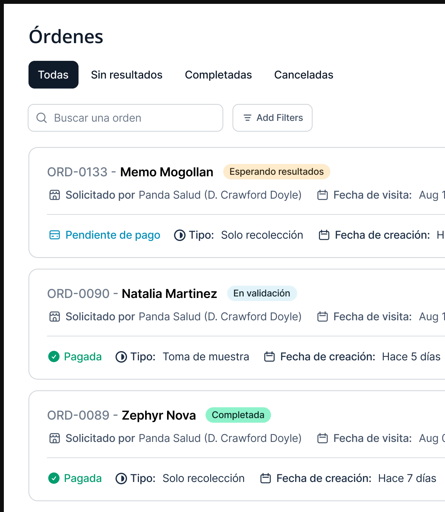
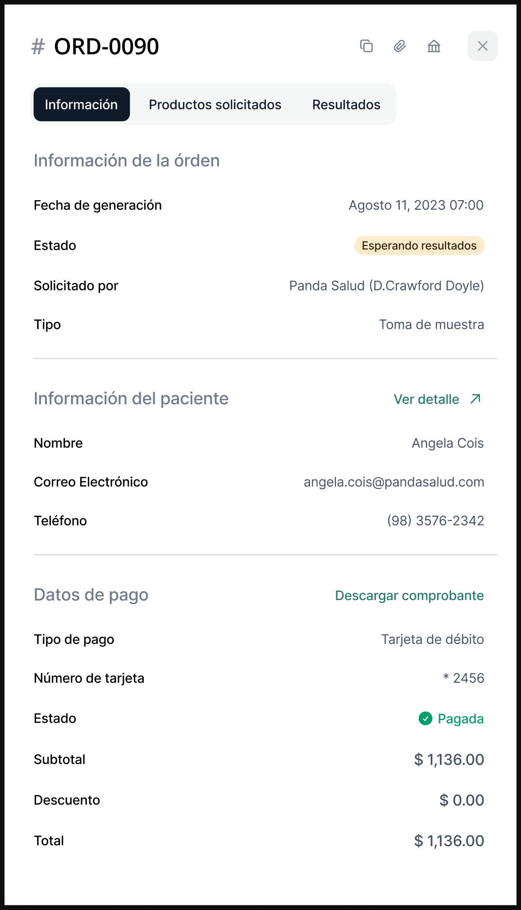

Panda Salud es una plataforma que permite a los médicos y pacientes acceder a estudios clínicos de forma sencilla y segura. La plataforma permite a los médicos buscar estudios clínicos para sus pacientes y obtener los resultados de forma rápida.

## Problema inicial
Una de las principales razones de rediseñar su plataforma es proveer una mejor experiencia para los médicos al hacer la solicitud de estudios clínicos. La plataforma actual que está en funcionamiento es muy complicada de utilizar y difícil de comprender, lo que provoca que los médicos tengan dificultades al realizar la solicitud de estudios.

Tomando esto en consideración, se realizaron pruebas de usabilidad y se encontraron los siguientes problemas:
-  Generar una orden de estudios clínicos es difícil de procesar, debido a que el proceso no es intuitivo para el usuario.
-  Es difícil encontrar los estudios clínicos que se necesitan para los pacientes.
-  No hay una forma de ver el estatus de los estudios clínicos que se han solicitado de forma simple y detallada.

## Mejorando la navegación
Al realizar la nueva arquitectura de navegación, se tomaron en cuenta los elementos primordiales y de mayor uso por parte de los médicos, tales como la búsqueda de estudios clínicos, la generación de órdenes y el seguimiento de los pacientes. Después de esto, en segundo lugar, tenemos todo lo financiero, como los pagos y las comisiones.

Además, hemos agregado un widget de soporte para ayudar a los primeros usuarios a entender el funcionamiento de la plataforma.

## Visualización de los estudios

Ahora, el siguiente objetivo era mejorar cómo se visualizan los estudios en la plataforma. Destacando algunos campos de mayor importancia tales como el nombre del paciente, el número de la orden y el estado del estudio clínico.

## Información de la orden y pagos
Algo que también se rediseñó fue el detalle de la orden, para que el médico pueda ver de forma detallada la información de la orden y el detalle del pago.

## Conclusión

En general, se logró el objetivo de mejorar la experiencia de los médicos al utilizar la plataforma. De esta manera, se espera que los médicos puedan realizar las solicitudes de estudios clínicos de forma más rápida y sencilla. Además, logramos que el diseño cumpliera con las necesidades específicas de los médicos para mejorar su flujo de trabajo en el día a día.