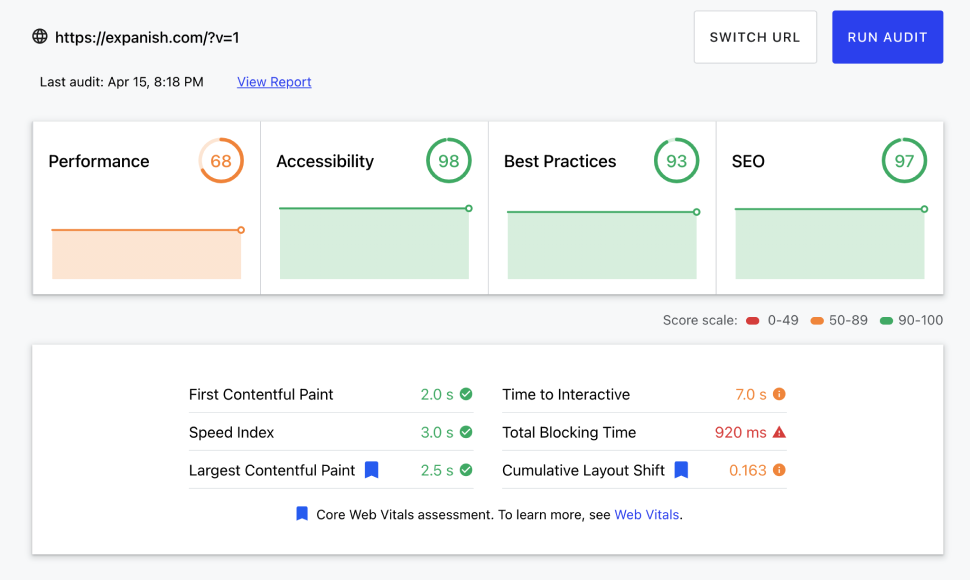

Expanish es una escuela de español con sede en Argentina y España, y se especializa en la enseñanza del idioma español a estudiantes internacionales. La escuela ofrece diferentes tipos de programas, tales como, cursos grupales, clases privadas, cursos de largo plazo, entre otros.

## Retos a resolver
Algo en lo que se comenzo a trabajar fue en el rediseño del sitio web tomando como principal enfoque los dispositivos móviles. Por lo que el rediseño del sitio web se realizó con un enfoque mobile-first, para garantizar una experiencia de usuario óptima en dispositivos móviles.

De igual manera, se busca mejorar la velocidad de carga del sitio web, tomando en consideración los Core Web Vitals de Google, para mejorar el posicionamiento en los resultados de búsqueda.

## Situación actual

Como se puede ver en la versión actual, el hero del sitio web no es muy atractivo y no muestra la esencia de la escuela, haciendo que los usuarios no se sientan atraídos a explorar más sobre los destinos disponibles y los programas que ofrece la escuela.

Lo que se busca con el nuevo rediseño, es empujar a los usuarios a que exploren más sobre los destinos que se tiene disponible y tenga la curiosidad por saber más sobre lo que ofrecen.

### Rendimiento
En estos momentos, el sitio web se encuentra construido sobre Next.js utilizando SSR, lo que hace que el sitio web cargue lento pero sea muy óptimo para el SEO.

El principal problema en este momento, es el tiempo que toma en obtener la información necesaria para renderizar la página, por lo que afecta a las métricas tales como TBT (Total Blocking Time) y TTI (Time to Interactive), lo que hace que el sitio web no sea muy óptimo para los usuarios y sea penalizado por Google.

## Propuesta de rediseño
La palabras del cliente, fueron necesitamos un sitio limpio, moderno y que sea rápido. Por lo que se propuso un diseño claro y moderno, utilizando la paleta de colores de la marca y utilizando imágenes de alta calidad para mostrar la esencia de la escuela.

### Página principal
Lo principal para el negocio es propiciar la adquisición de leads por medio de la página principal, por lo que en esta primera pantalla se agrego un widget donde el usuario puede interactuar con las cursos y destinos disponibles de acuerdo a sus necesidades. También, hemos agregado en la sección un bloque donde mostramos de manera clara los destinos.

### Página de destino
En esta se busca mostrar de manera clara y concisa la información de cada uno de los destinos, para que el usuario pueda tener una idea clara de como es el lugar, que programas se ofrecen y que actividades se pueden realizar.

## Tecnologías utilizadas
Para el desarrollo del sitio, se utilizó Next.js con Static Site Generation, lo que permite que el sitio web sea generado de manera estática y sea muy rápida la carga sin comprometer el SEO. Para gestionar el contenido, se utilizó Strapi un CMS headless que permite gestionar el contenido de manera fácil y rápida.

Esto ayudo a mejorar considerablemente el rendimiento del sitio web, como se puede ver en las siguientes métricas.

